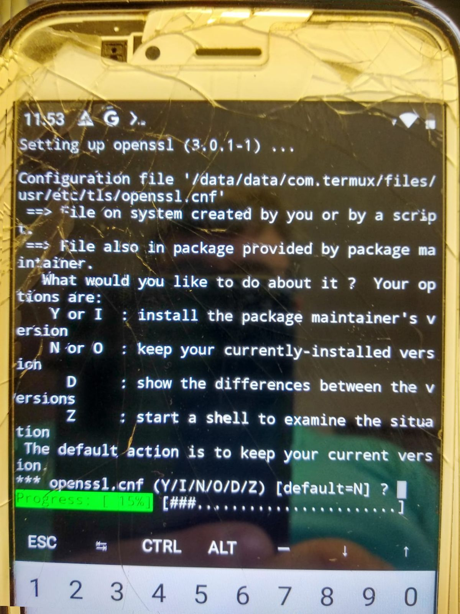

En esta entrada inicial Oscar nos explica como realizo la instalación de un servidor nodered en un equipo Android.

--------------------------------

## [Node-RED](#Node-RED)

Is a programming tool for wiring together hardware devices, APIs and online services in new and interesting ways.

It provides a browser-based editor that makes it easy to wire together flows using the wide range of nodes in the palette that can be deployed to its runtime in a single-click.

--------------------------------

Para usar un celular "viejo" como servidor de node-red (y seguramente para otras cosas en que se use una Raspery Pi).

Primero  instalr desde appstore: termux.

Una vez en termux ejecutar los siguientes comandos dandole `Y` cada vez que se detiene a preguntar si estamos seguros:

El tutorial que vi indicaba estos comandos, el tercero y cuarto me dieron error creo que porque la version de la appstore es vieja y la estan dejando de mantener.

Cuando finalizé la instalacion me alerto sobre ese cambio de rumbo y aconseja descargar otras opciones desde github *(gente que le gusta complicar lo que ya funciona)*.

```bash
apt update
apt upgrade
apt install coreutils nano nodejs # (este me da error)
npm i -g --unsafe-perm node-red # (este me da error)
node-red
```

en cambio use esta secuencia :

```bash
apt update
apt upgrade
pkg install nodejs # (este me lo sugiere en error de la secuencia anterior)
npm i -g --unsafe-perm node-red
npm install -g npm@8.5.3
node-red # (con esto dejamos corriendo Node-red y podemos apagar la pantalla del cel o usarlo en otra cosa)
```



En otro equipo entramos a la direccion ip del celular, que ya tendriamos que haber seteado como ip fija:

`http://192.168.0.126:1880/`
